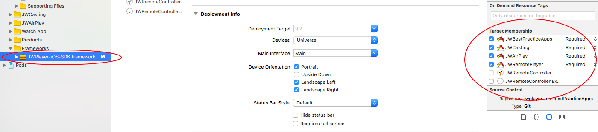

# JW Player iOS Best Practice Apps

This repository is used to present Objective-C code which can be used to achieve custom functionality with your JW Player. 
The JWBestPracticeApps XCode project is composed of several targets which can be run as separate iOS applications. 
Each target adds a level of complexity to the base target, JWBestPracticeApps, which creates a basic JW Player with minimal customization. In each target, classes inherit from classes of more basic targets, allowing us to present relevant code in a clear way and spare you the redundancy.

- The target named JWAirPlay presents the necessary code to add an AirPlay button to your app, and cast the video via AirPlay.

- The target named JWCasting presents the code necessary to cast our JW Player to a Chrome Cast device.

- The target named JWRemoteController is an Apple Watch app capable of controlling the JW Player in the iOS App named JWRemotePlayer.

## Initial Setup:

Import the JW Player iOS SDK to the project, add your JWPlayer key to the info.plist in the JWBestPracticeApps target and link the JWPlayer iOS SDK. To avoid importing the JW Player iOS SDK to each target, import it once to the JWBestPracticeApps target and set its Target Membership to each target, as seen in the following screenshot:

For more instructions please visit the official JW Player Developer guide at http://developer.jwplayer.com/sdk/ios/docs/developer-guide/

For targets that require casting to Google ChromeCast, you must import a Google ChromeCast Framework, as well as all of its depending frameworks. For the list of necessary frameworks please visit https://developers.google.com/cast/docs/ios_sender#setup

**Note**: The demo apps in this repository are intended to be used with **version 2.2** of the JW Player iOS SDK.

**Feedback**: Was this repository helpful? How can we improve it? Please send your feedback to support+sdk@jwplayer.com.
